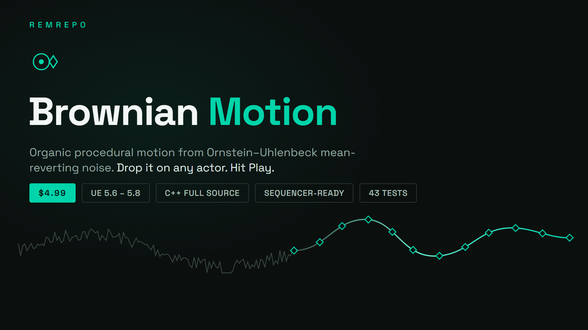
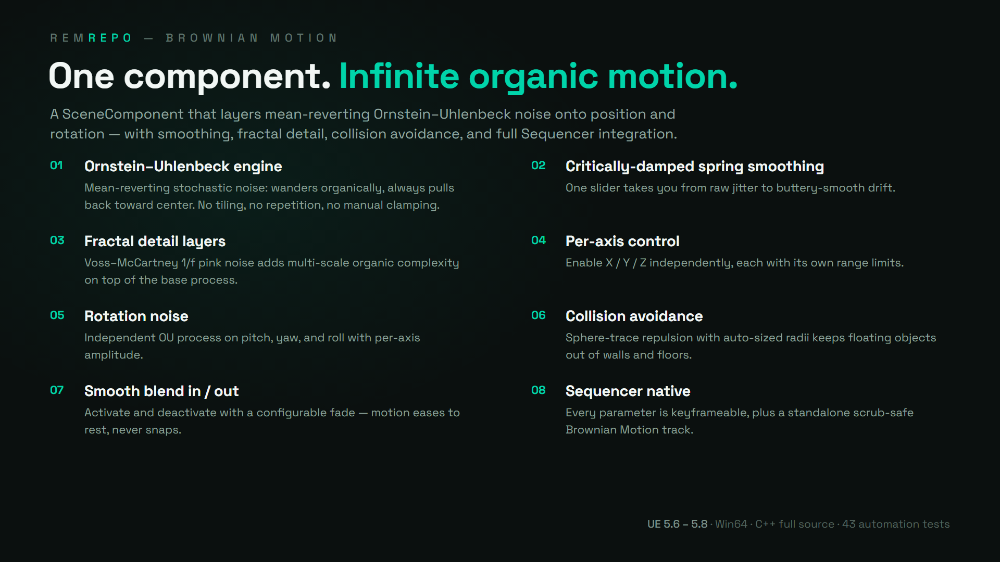
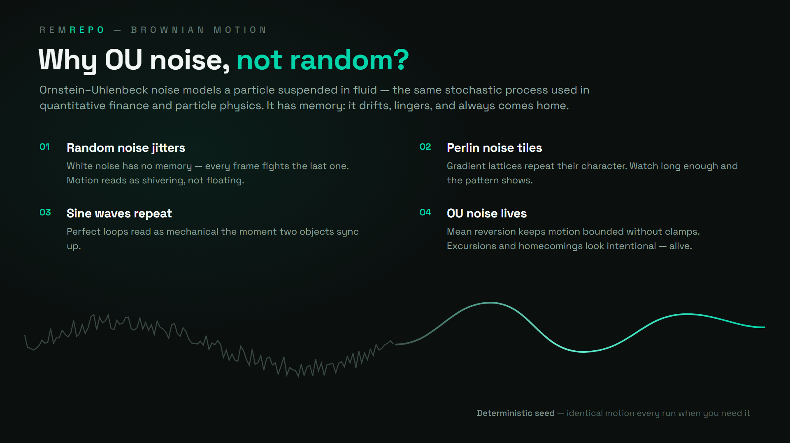

# Brownian Motion

**Ornstein–Uhlenbeck mean-reverting noise component — organic procedural motion for any actor. Sequencer-ready.**

---

Brownian Motion is an Unreal Engine plugin by [REMrepo](https://github.com/REMvisual). It adds a C++ SceneComponent that drives any actor with Ornstein–Uhlenbeck mean-reverting noise — motion that wanders organically but always pulls back toward center. Unlike random noise (jitters), Perlin noise (tiles), or sine waves (repeat), OU noise models a physical particle suspended in fluid: the result reads as *alive*.

This repository is the public **issue tracker** and product page for the plugin. The plugin ships with full C++ source (two modules, 43 automation tests).

## Highlights

- **Ornstein–Uhlenbeck noise engine** — mean-reversion strength, speed, and amplitude controls
- **Critically-damped spring smoothing** — raw jitter to buttery drift with one slider
- **Voss–McCartney fractal detail** — 1/f pink-noise layers for multi-scale complexity
- **Per-axis ranges** — enable X/Y/Z independently with separate limits
- **Rotation noise** — independent OU process on pitch/yaw/roll
- **Collision avoidance** — sphere-trace repulsion, auto-sized from mesh bounds
- **Smooth blend in/out**, **deterministic seed**, **editor preview without PIE**
- **Full Sequencer integration** — every parameter keyframeable, plus a standalone scrub-safe Brownian Motion track
- **43 headless automation tests** — axis isolation, range coverage, determinism, collision, smoothness, performance

## Install

1. Get Brownian Motion on [Fab](https://www.fab.com/sellers/REMrepo) — installs via the Epic Games Launcher for UE 5.6, 5.7, and 5.8
2. Launch the editor and enable **Brownian Motion** under Edit → Plugins
3. Add a **Brownian Motion** component to any actor — motion starts with sensible defaults on Play

## Documentation

**[📖 Full documentation → DOCUMENTATION.md](DOCUMENTATION.md)** — setup, both usage modes, complete parameter reference (every default and range), Blueprint API, Sequencer integration, recipes (drift, handheld camera, jitter), performance notes, and troubleshooting.

## Use cases

Floating debris and particles · camera drift and handheld shake · ambient object motion (lanterns, buoys, signs) · procedural idle animation · atmospheric fog/light drift · cinematic camera wander.

## Free TouchDesigner version

The same OU math is available free as a TouchDesigner Script CHOP: [td-BrownianMotion](https://github.com/REMvisual/td-BrownianMotion).

## Support

Bug reports and feature requests: [GitHub Issues](https://github.com/REMvisual/ue-BrownianMotion/issues)

More from REMrepo: [Property Recorder](https://github.com/REMvisual/ue-PropertyRecorder) (FREE — record live Actor changes as Sequencer keyframes)
